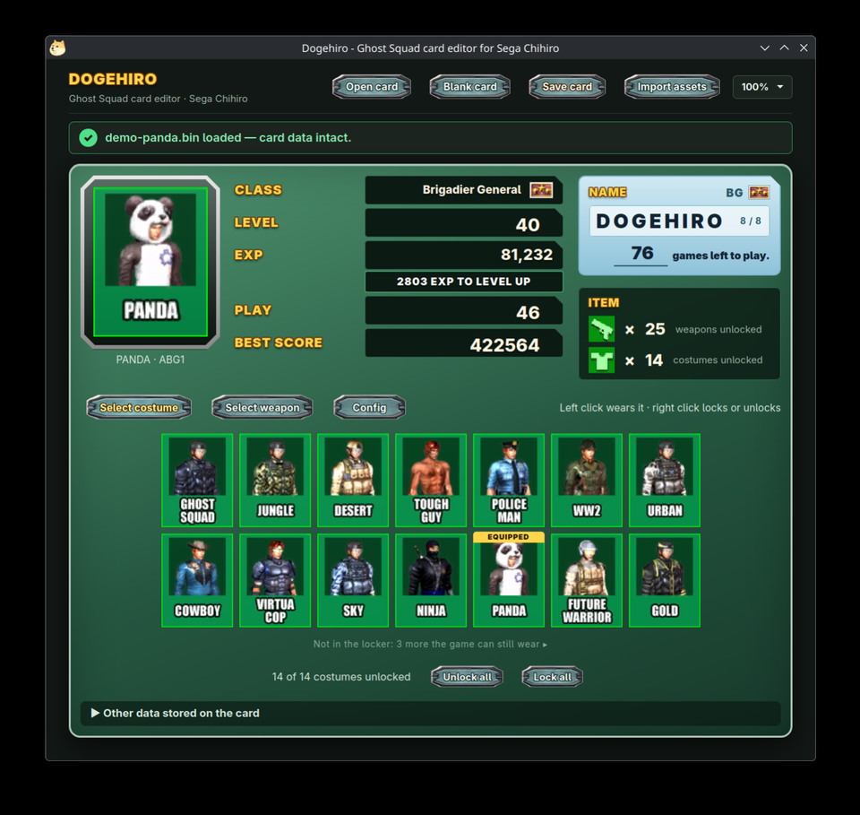
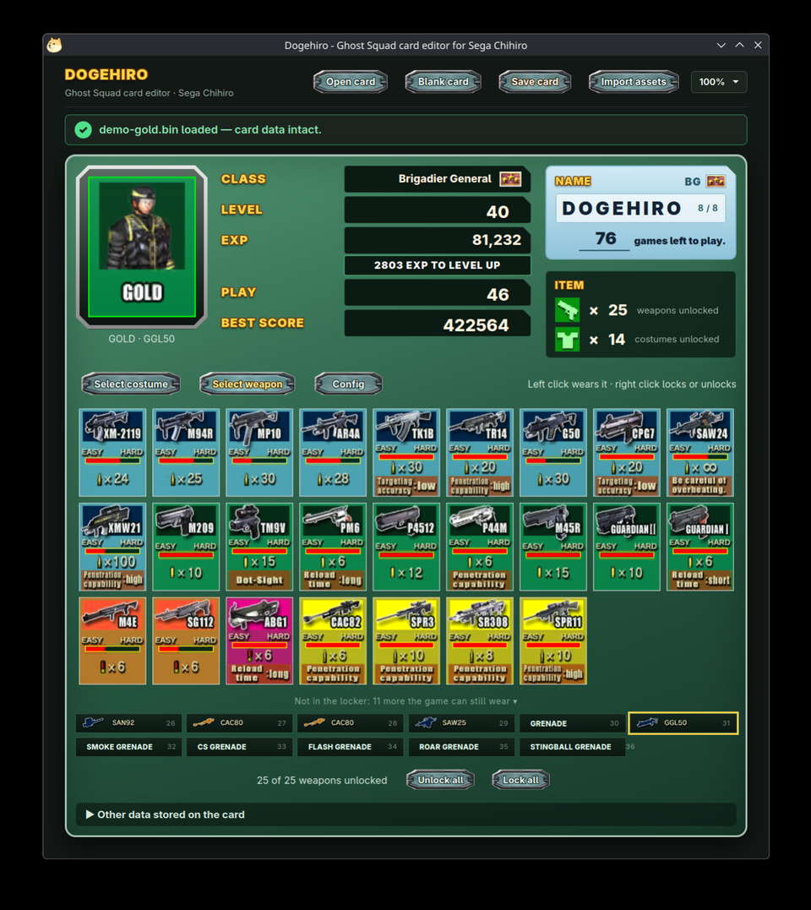

# Dogehiro


A card editor for **Ghost Squad** (Sega Chihiro): the cards of its HW210 card
reader, as the Chihiro build of [xemu](https://xemu.app) saves them.

Open a card, change what the game would have let you earn (level, rank, mission
levels, costumes, weapons, games left) and save it. Dogehiro writes the same
bytes the game writes, so the game accepts the card.

It also offers the fourteen items the game has but never lists: three costumes
and eleven weapons (`SAN92`, `CAC80`, `SAW25`, `GGL50`, five grenades).

| Costumes | Weapons |
|---|---|
|  |  |

- **Open card**: a 2048-byte card file. A damaged card is repaired as the game repairs it
- **Blank card**: a new card as the game makes it: 100 games, one weapon, two costumes
- **Save card**: write the card back
- **Import assets**: extract the game's pictures from your own copy of the game
- **Mission Lv.**: each mission's level, 1 to 16, with the items it unlocks
- **100%**: page size, remembered

In the item lists, left click equips an item and right click locks or unlocks it.
Imported pictures go to an `assets` folder next to the program; without them,
items show as names. To open a card directly: `dogehiro path/to/card.bin`

## Building

```
cmake -B build -DCMAKE_BUILD_TYPE=Release
cmake --build build
```

| System  | Needs |
|---------|-------|
| Windows | the WebView2 runtime, installed with Edge |
| macOS   | nothing |
| Linux   | `libgtk-3-dev` and `libwebkit2gtk-4.1-dev` |

On Linux, `GDK_BACKEND=x11` forces X11; the window icon only shows under X11.

## Testing

```
ctest --test-dir build
./build/dogehiro-selftest <game image>
```

## Licence

GPL v3 or later, see `LICENSE`. `third_party` holds
[webview](https://github.com/webview/webview) (MIT) and the Microsoft WebView2
headers (Windows only).

The game's pictures belong to Sega. None are in the program or in this
repository, apart from the two screenshots.
